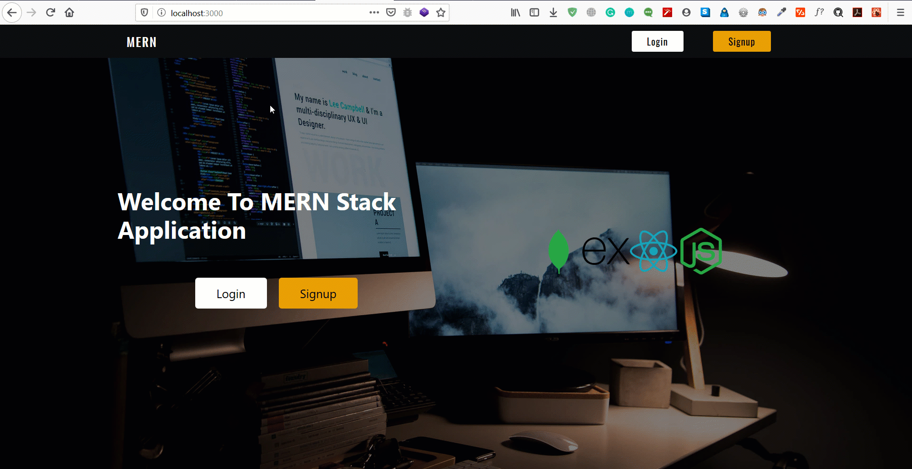

# **Simple User Registration and Login functionality with MongoDB, ExpressJs, React and NodeJs [MERN]**


Full-stack MERN app with authentication using passport and JWTs.

This project uses the following technologies:

- [React](https://reactjs.org) and [React Router](https://reacttraining.com/react-router/) for frontend
- [Express](http://expressjs.com/) and [Node](https://nodejs.org/en/) for the backend
- [MongoDB](https://www.mongodb.com/) for the database
- [Redux](https://redux.js.org/basics/usagewithreact) for state management between React components


## Configuration

Make sure to add your own `mangoURI` from your [MangoDB](http://mangodb.com) database and put in  `config/default.json`.

```javascript
{
    "mongoURI": "YOUR_MONGO_URI_HERE",
    "secretOrKey": "secret"
}
```

## Quick Start

```javascript
// Install dependencies for server & client
npm install && npm run client-install

// Run client & server with concurrently
npm run dev

// Server runs on http://localhost:5000 and client on http://localhost:3000
```


For deploying to Heroku, put this code in server.js or app.js

```
//Serve static assets if in production
if (process.env.NODE_ENV = "production") {
    app.use(express.static('client/build'));

    app.get('*', (req, res) => {
        res.sendFile(path.resolve(__dirname, 'client', 'build', 'index.html'));
    });
}
```
Make sure to put the script in server package.json file

    "heroku-postbuild": "NPM_CONFIG_PRODUCTION=false npm install --prefix client && npm run build --prefix client"


for more in deploying to Heroku, please refer to [this](https://www.youtube.com/watch?v=71wSzpLyW9k) helpful video by TraversyMedia.